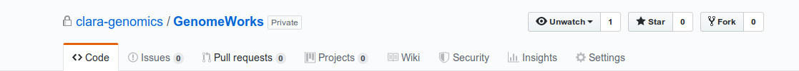
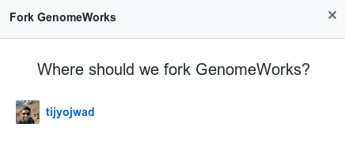
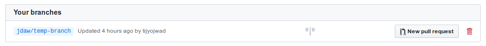
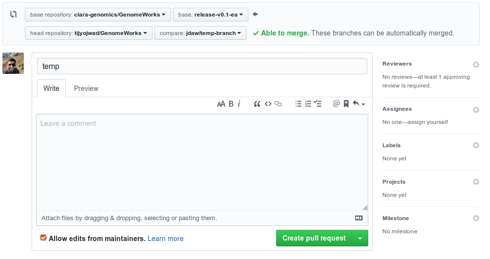
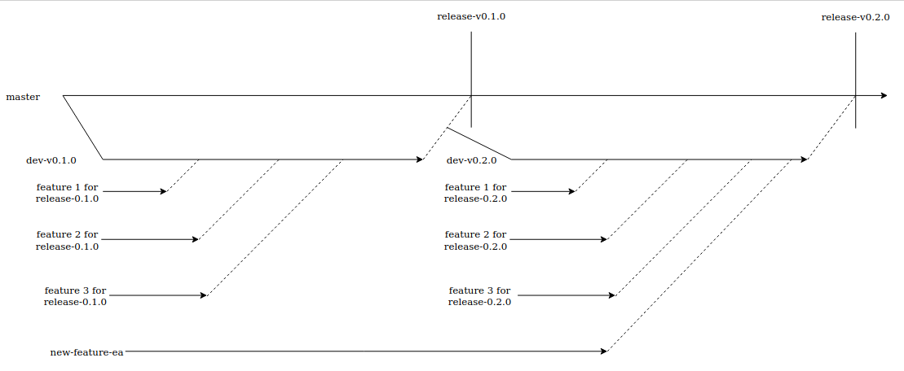

---
---
# Development Guide

Welcome to the Clara Omics development guide. This page will cover the following information - 
1. [Contributing to Clara Omics](#contributing-to-clara-omics)
2. [Coding style](#coding-style)
3. [CI Testing](#ci-testing)
4. [Release Methodology](#release-methodology)

## Contributing to Clara Omics

The developer flow Clara Omics projects is based on the standard Fork and Pull Request (FPR) Workflow followed by git developers. A good article on the flow can be found [here](https://gist.github.com/Chaser324/ce0505fbed06b947d962).

### Create a fork

In FPR, the first step is to create a new fork of the repository.

1\. Go to the actual repository page, and click on the "Fork" button on the top right.



2\. Once you click on Fork, a pop up will ask where the fork should reside. Click on your own user as the destination of the fork.



3\. After that, you should be able to see a new repo under your user.

### Clone fork and add new remote

1\. Clone the fork recursively from your user to your local computer.

```git clone --recursive git@github.com:<GITHUB_USERNAME>/ClaraGenomicsAnalysis.git```

2\. Once the clone is complete, add the upstream repo (the original repo from where you forked), as another remote.

```git remote add clara-genomics git@github.com:clara-genomics/ClaraGenomicsAnalysis.git````

3\. To verify that new remove was added, check all remotes.
The command below should show `clara-genomics` as a remote for fetch and push.

```git remote -v```

### Keeping your fork up to date

It's very important that your local clones are kept up to date with remote repositories.
To ensure that, it is advised to frequently fetch from the remotes.

```
git fetch origin
git fetch clara-genomics
git fetch <any-other-remotes>
```

While it is perfectly reasonable to pull changes from the upstream remote and push them to your fork,
it's not a necessary step. Feature branches can be easily created from branches in other remotes,
as explained in the next section.

### Making changes

Development should always happen in branches in your local fork. This helps keep the upstream remote branch
history clean while allowing developers to experiment freely in their own space.

Our naming convention for branches is `<username>/<feature-description>`. It is helpful to have username in the
branch name for local testing by reviewers (explained in subsequent sections).

To create a branch from another remote -

```
git checkout -b <username>/<feature-desc> <remote>:<branch>
```
e.g.
```
git checkout -b jdaw/add-new-feature clara-genomics:dev-v0.2.0
```

#### Note on commit messages
Commit messages should be of the following format

```
[module] brief

detailed description
```

e.g.
```
[tests] cudapoa msa test

added tests for multi sequence alignment with varying read lengths
```

### Pushing to repo

As best practice, always merge the target branch into your feature branch before pushing. This helps keep changes up to date with the rest of the community's contributions. 
Make sure to push your changes to your own fork.

### Creating a pull request for review

A pull request is the process of merging a branch from your local repo into the upstream repo.
It's like asking the author of the upstream repo to `pull` in your changes into their code.

Creating a pull request is really simple. Just follow the GitHub UI do that -

1\.Go to the GitHub page for branches in your fork, and hit the "New Pull Request"



2\. This will take you to a page where you choose the base branch to compare against. Select the repo as clara-genomics/<repo_name> (this is the upstream repo)
and the base branch you want your changes merged into (this is typically where the branch was created from).
Add a descriptive message for your changes, select the reviewer and assignee, and hit "Create pull request".



3\. As the reviewers request changes, update your branch with edits, merge latest changes from upstream, and push your work to the same branch.
Let the requester of the change resolve issues, except in the case of small tasks like typos/formatting errors.

* Make changes to code.

```
vim my_file.cpp # and make edits
git add my_file.cpp
git commit
```

* Fetch changes to upstream base branch

```
git fetch <remote>
```

* Merge upstream changes into feature branch

```
git merge <remote>/<branch>
git push
```

### Reviewer Flow

1\. As a review, first step is to clone the repo into which the PR is being merged.

2\. Then fetch the pull request changes from the remote repository by the pull request number

```
# Creates a new local branch named <new_local_branch_name> which contains the pull request changes
git fetch <remote> pull/<pull_request_number>/head:<new_local_branch_name>
```

3\. Checkout the new branch and test the changes locally:

```git checkout <new_local_branch_name>```

4\. If any issues are found, please request changes in the review directly. Once the developer makes the necessary changes, verify and close the issues if satisfied.

### Merging an MR

Before merging an MR, please ensure that all open discussions are resolved and tests pass. Then merge the pull request using the GitHub UI.

## Coding Style

A list of guidelines for a common coding style across the project can be found in our [Coding Style Guidelines](https://clara-genomics.github.io/coding_style_guidelines.html).

## CI Testing

Clara Omics CI testing makes use of the GPU-aware testing framework called [gpuCI](https://docs.rapids.ai/gpuci) developed by RAPIDS.

Each PR into one of the protected branches (`dev-vX.Y.Z` or `master`) will trigger automatic tests. Tests can also be run locally using the instructions
under the `Testing` section of the relevant repository. If you are a first time contributor (thank you!) and are unable to run tests, please ping one of the
admins of the repo to ask for help.

## Release Methodology



### master branch

`master` branch always contains stable code. Releases are tagged as specific commits in the master branch.
master branch sees no development directly on it. In the case of urgent hot fixes, a special PR may be merged into master.
However, these changes need to be carefully merged concurrently into the closest dev branch as well in order to percolate the changes
throughout the tree.

### dev-vX.Y.Z branch

Branches following the dev-vX.Y.Z branches are considered the development branches for release X.Y.X.
These branches are typically branched out from the previous release a week or so before the final release of the previous version.
All features and bug fixes for a specific release are merged into the feature branches. At the end of a release,
the feature branch is merged into master and tagged as a fresh release.

### feature-ea branch

Some features developed as part of Clara Genomics will be release in early access mode.
These features will be branched off like a dev branch, and maintained like one till the branch is ready for release.
Once it is ready for release, that branch will be merged into the closest dev-vX.Y.Z branch first,
and then promoted into master through the usual release process. PRs specific to this feature will be merged into the feature-ea branch.
These branches, like other feature branches, will be kept up-to-date by frequently merging the closest dev-vX.Y.Z branch.

#### Version Naming

Our releases will follow the [Semantic Versioning](https://semver.org/) guidelines.
